# Project System & Process Diagrams Catalog
### Visualizing the Enterprise Online Examination & Learning Management Suite

This document consolidates **31 core diagrams** mapping out the **Project Management**, **Process & Workflows**, **Technical & System Designs**, and **Advanced Security, Runtime States & Logic Diagrams** of the Exam Portal suite using standard Mermaid.js notation.

---

## 1. Project Management Diagrams

### A. Project Network Diagram (Critical Path Method)
This diagram maps task dependencies, early start/finish times, and durations to establish the **Critical Path** (marked with double-lined nodes and bold borders) required to build the entire suite.

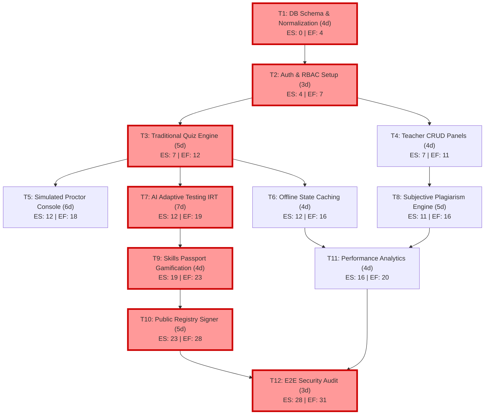

---

### B. High-Level Project Roadmap & Milestones
This Gantt roadmap outlines the timeline and critical milestones across the five primary development streams.

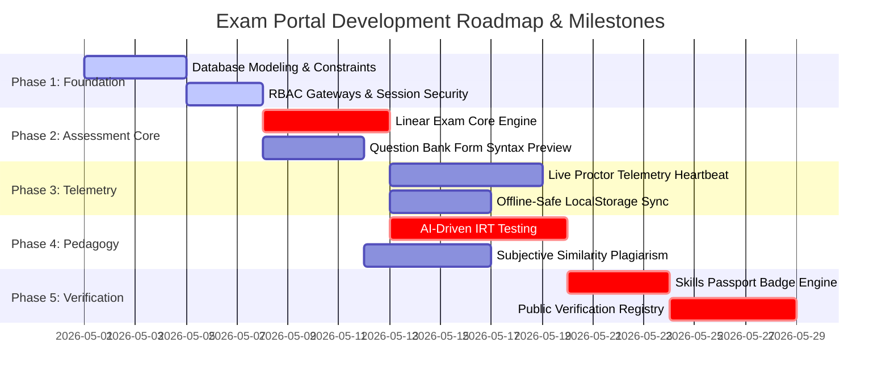

---

## 2. Process & Workflow Diagrams

### A. Standard Flowchart: Candidate Exam Session Loop
This flowchart maps the logical steps a student follows from the portal login down to certificate issuance, including network status forks and proctor warnings.

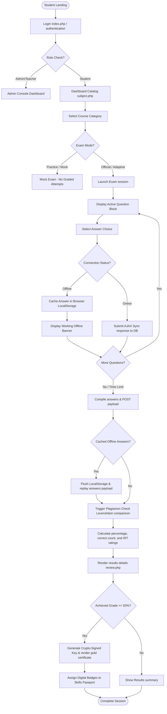

---

### B. Cross-Functional Swimlane Diagram
This lane chart splits student actions, instructor commands, server-side controller processing, and database commitments.

```mermaid
flowchart TB
    subgraph Student Client (Browser Domain)
        S1[Select Exam in Dashboard] --> S2[Enter quiz.php Workspace]
        S2 --> S3[Answer MCQ Selection]
        S3 --> S4[3s Asynchronous Heartbeat Polls]
        S5[Display Proctor Blurred Pause Overlay]
        S6[Submit Completed Attempt JSON]
    end

    subgraph Teacher / Proctor Command GUI
        P1[Set Cohort Access Calendars]
        P2[Monitor Candidate Live Telemetry Grid]
        P3[Trigger Warning Alert OR Pause command]
    end

    subgraph Application Middleware Controller (PHP 8.x)
        A1[Enforce Session Guard & Role validation]
        A2[Process Proctor Telemetry Checks]
        A3[Adaptive Engine Level Shifter]
        A4[Levenshtein Plagiarism String Scanner]
        A5[Cryptographic Signature Certification generator]
    end

    subgraph Database Persistence Layer (MySQL/MariaDB)
        D1[(Validate Cohort Schedules)]
        D2[(Update Attempt proctor_paused Status)]
        D3[(Commit Answer to attempt_answers)]
        D4[(Log Plagiarism Similarity Score)]
        D5[(Store Signatures & Passwords)]
    end

    P1 --> D1
    D1 --> S1
    S2 --> A1
    A1 --> S3
    S3 --> D3
    S4 --> A2
    A2 <--> P2
    P3 --> D2
    D2 --> S4
    S4 --> S5
    S6 --> A4
    A4 --> D4
    A3 --> S3
    A5 --> D5
```

---

### C. BPMN: End-to-End Examination Lifecycle
This BPMN model maps the business flow between the Candidate Pool and the Proctor Pool across various gateways.

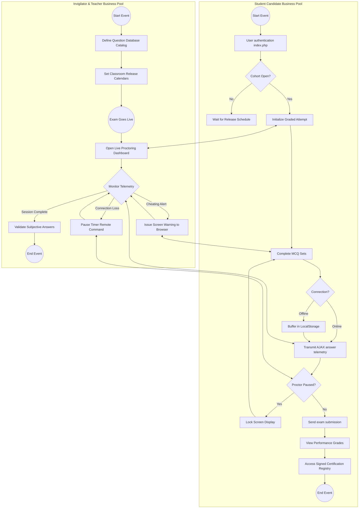

---

### D. Value Stream Map: Information and Asset Flows
This maps the lead time and cycle times for academic assets (questions, answers, certificates) moving from preparation to evaluation.

```mermaid
flowchart TD
    subgraph Information Flow
        Admin[Admin / Teacher Coordinator] -->|1. Setup Schedules & Syllabus| CoreDB[(Core Database)]
        Proctor[Live Proctor Console] -->|2. Asynchronous Controls| SessionCtrl[Attempt Heartbeat Control]
    end

    subgraph Production Flow (Value-Add Path)
        RawQ[Unsolved Questions Repository] -->|1. Pull Pool| Quiz[Active quiz.php Session]
        Quiz -->|2. Buffer Answers| LocalState[Client LocalStorage]
        LocalState -->|3. Sync AJAX| GradedState[Evaluated Attempt Answers]
        GradedState -->|4. Algorithmic Grading| CertGen[Signed Certificates Registry]
    end

    subgraph Timelines (Cycle Time vs. Delay)
        TimeLine1["Question Pull Delay: 50ms"] -.-> Quiz
        TimeLine2["Student Solving Time: 45 min"] -.-> LocalState
        TimeLine3["Network Sync Time: 300ms"] -.-> GradedState
        TimeLine4["Levenshtein Check Delay: 2s"] -.-> CertGen
    end
```

---

### E. Student Exam Dashboard Visibility & Scheduling Resolution Flowchart
This maps the access verification pathway executed dynamically in `subject.php` to resolve classroom calendar availability for candidates.

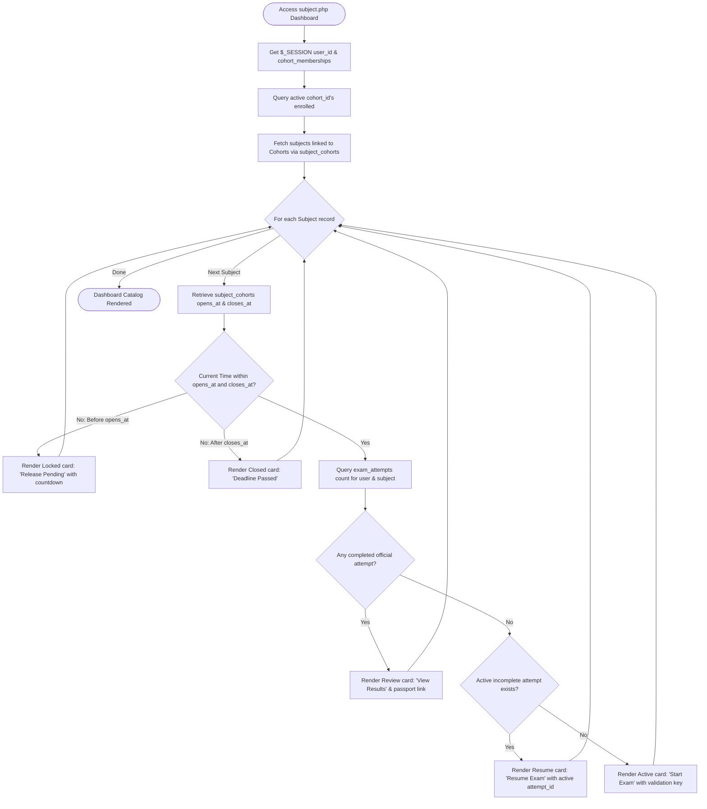

---

### F. Skills Passport Gamification Rule & Achievement Engine Decision Matrix
This visualizes the rule pipelines executed on attempt submission to reward and commit digital credentials into `user_badges`.

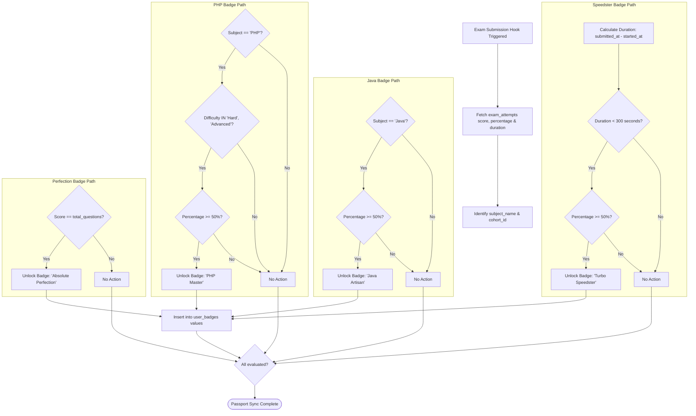

---

## 3. Technical & System Design Diagrams

### A. UML Class Diagram: Portal Software Blueprints
This class diagram specifies database properties, logic functions, and associations between core system classes.

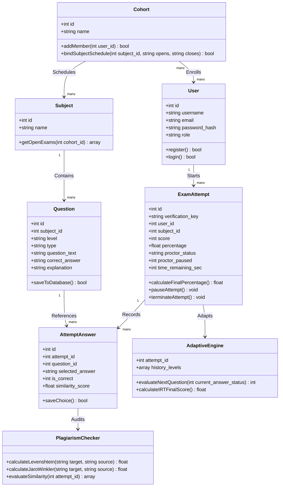

---

### B. UML Sequence Diagram: Telemetry Polling & Proctor Control
This sequence details the interactions between the Student's browser, the heartbeat handler, the proctor's dashboard, and the database.

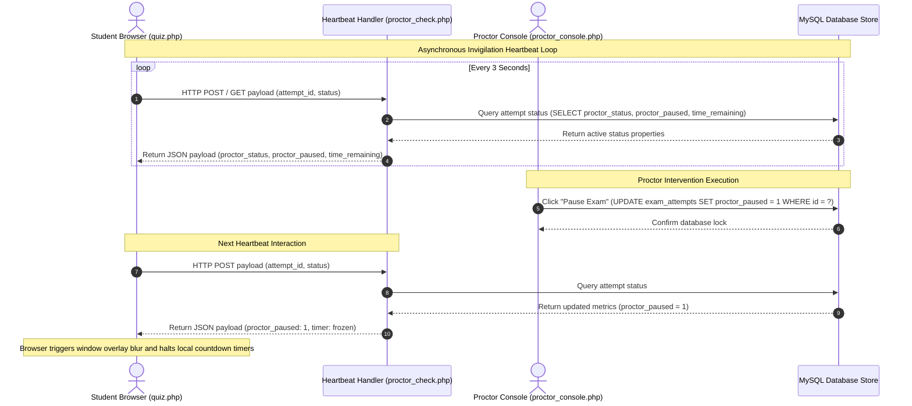

---

### C. Entity-Relationship Diagram (ERD): Logical Database Schemas
This designs the database tables, indices, data types, and primary-foreign key linkages.

```mermaid
erDiagram
    users {
        int id PK
        string f_name
        string m_name
        string l_name
        string u_name UK
        string u_email UK
        string u_pass
        int u_age
        string u_mob
        text u_adr
        enum role
        timestamp created_at
    }

    subjects {
        int id PK
        string name UK
    }

    questions {
        int id PK
        int subject_id FK
        enum level
        enum type
        text question
        text option_a
        text option_b
        text option_c
        text option_d
        string correct_answer
        text explanation
    }

    cohorts {
        int id PK
        string name UK
        timestamp created_at
    }

    cohort_members {
        int id PK
        int cohort_id FK
        int user_id FK
        timestamp created_at
    }

    subject_cohorts {
        int id PK
        int subject_id FK
        int cohort_id FK
        datetime opens_at
        datetime closes_at
    }

    badges {
        int id PK
        string name UK
        text description
        string icon
        string condition_type
        string condition_value
    }

    user_badges {
        int id PK
        int user_id FK
        int badge_id FK
        timestamp unlocked_at
    }

    exam_attempts {
        int id PK
        string verification_key UK
        int user_id FK
        int subject_id FK
        enum level
        int total_questions
        int score
        decimal percentage
        datetime started_at
        datetime submitted_at
        enum exam_mode
        enum exam_type
        enum proctor_status
        tinyint proctor_paused
        int time_remaining_sec
    }

    attempt_answers {
        int id PK
        int attempt_id FK
        int question_id FK
        string selected_answer
        tinyint is_correct
        decimal similarity_score
    }

    users ||--o{ cohort_members : enlists
    cohorts ||--o{ cohort_members : holds
    subjects ||--o{ subject_cohorts : bounds
    cohorts ||--o{ subject_cohorts : schedules
    subjects ||--o{ questions : categorizes
    users ||--o{ exam_badges : collects
    badges ||--o{ exam_badges : unlocks
    users ||--o{ exam_attempts : performs
    subjects ||--o{ exam_attempts : tests
    exam_attempts ||--o{ attempt_answers : lists
    questions ||--o{ attempt_answers : matches
```

---

### D. Data Flow Diagram (DFD): Information Flow Dynamics
This Level-1 DFD tracks data transformations as information passes through the various verification pipelines.

```mermaid
flowchart TD
    subgraph Data Sources & Dest (External Entities)
        Student([Student Candidate])
        Proctor([Proctor Invigilator])
        Employer([Public Employer])
    end

    subgraph Process Workflows
        P1[1.0 Authenticate Session]
        P2[2.0 Proctor Telemetry Controller]
        P3[3.0 Question Shifter IRT Engine]
        P4[4.0 Plagiarism Evaluator Engine]
        P5[5.0 Certificate registry validation]
    end

    subgraph Data Stores
        D1[(User Directory)]
        D2[(Attempts Ledger)]
        D3[(Question Inventory)]
    end

    Student -->|1. Credentials| P1
    P1 -->|Query Credentials| D1
    D1 -->|Active Session Token| P1
    P1 -->|Redirect Session Status| Student

    Student -->|2. Hearts & Telemetry state| P2
    Proctor -->|3. Pause/Warn Commands| P2
    P2 -->|Log states| D2
    D2 -->|Sync session values| P2
    P2 -->|Screen Lock Indicators| Student

    Student -->|4. Answer selections| P3
    P3 -->|Evaluate Performance level| D3
    D3 -->|Higher/Lower difficulty MCQs| P3
    P3 -->|Update current grades| D2

    Student -->|5. Submit Exam attempt| P4
    P4 -->|Run Levenshtein match checks| D2
    D2 -->|Similarity Flags & grading| P4
    P4 -->|Write plagiarism score| D2

    Employer -->|6. Search Certification Key| P5
    P5 -->|Query Key validations| D2
    D2 -->|Grading Verification data| P5
    P5 -->|Gold Certificate Visual render| Employer
```

---

### E. System Architecture Diagram: Deployment Topologies
This details the production and intranet deployment infrastructure for high-concurrency event windows.

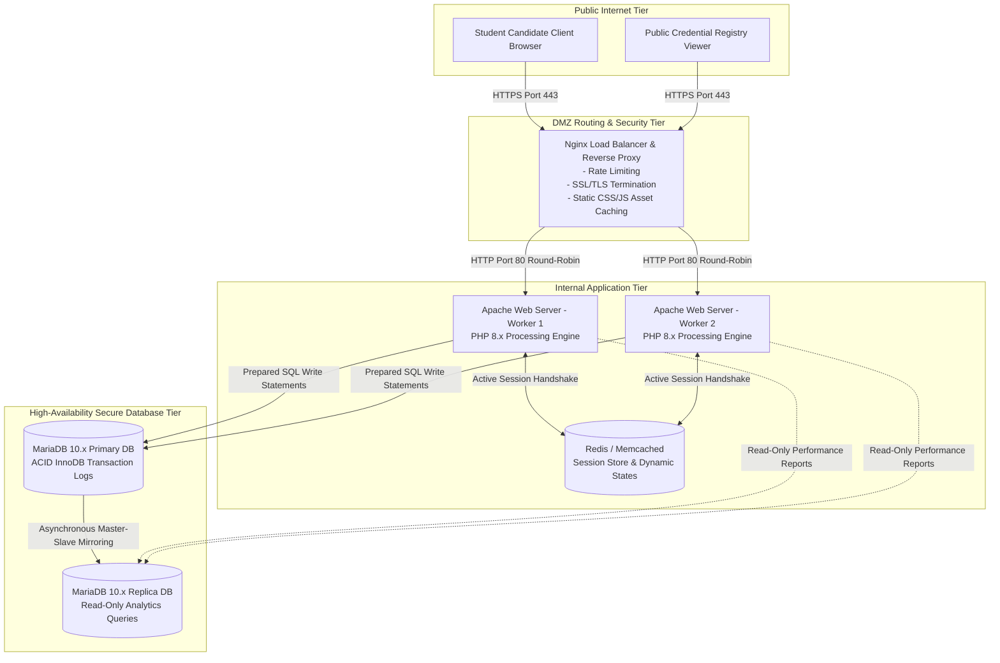

---

### F. Cryptographic Certificate Signing & Public Verification Ceremony Sequence Diagram
This maps the generation of HMAC SHA-256 signatures for passing students and the public search and verification checks on `verify.php`.

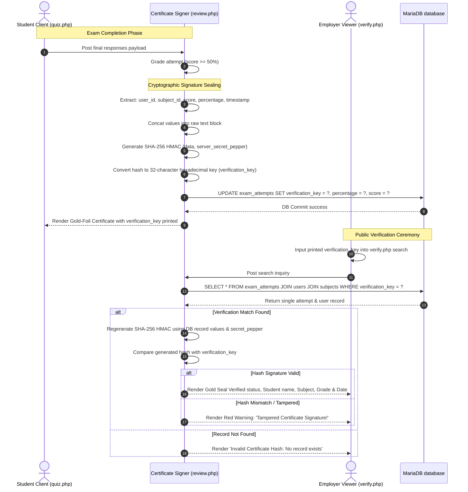

---

### G. Multi-Tenant Cohort Database Compartmentalization Object Diagram
This details structural relationships illustrating how databases block cross-tenant visibility leaks between cohort boundaries.

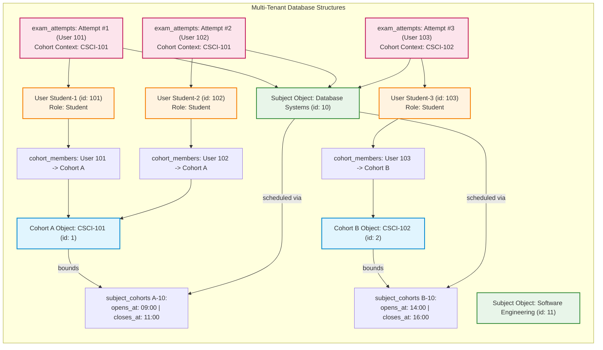

---

### H. Curriculum Performance Analytics & Statistical Insight Level-2 DFD
This traces specific sub-process data transformations yielding Bell curves, hardest questions, and low-average support warning triggers.

```mermaid
flowchart TD
    subgraph Data Stores
        D_Attempts[(exam_attempts Table)]
        D_Answers[(attempt_answers Table)]
        D_Questions[(questions Table)]
        D_Users[(users Table)]
    end

    subgraph Process 6.0: Performance Analytics Engine (analytics.php)
        P6_1[6.1 Aggregate Cohort Grades]
        P6_2[6.2 Compute Bell-Curve Data Points]
        P6_3[6.3 Calculate Question Accuracy Ratios]
        P6_4[6.4 Scan Student Averages for Support Warnings]
    end

    subgraph Outputs & Displays
        V_Bell[Bell-Curve Grade Distribution Charts]
        V_Gaps[Top 5 Hardest Questions Report]
        V_Warns[Academic Support Warning Registry]
    end

    %% Pipeline 1: Bell Curve
    D_Attempts -->|Raw Score & Percentages| P6_1
    P6_1 -->|Score distributions| P6_2
    P6_2 -->|Standard Deviations & Bell Plot Coordinates| V_Bell

    %% Pipeline 2: Hardest Questions (Syllabus Gaps)
    D_Questions -->|Question IDs & Text| P6_3
    D_Answers -->|is_correct metrics| P6_3
    P6_3 -->|Select lowest accuracy questions ratio < 40%| V_Gaps

    %% Pipeline 3: Low Performance Student warnings
    D_Users -->|User IDs & Names| P6_4
    D_Attempts -->|Running averages| P6_4
    P6_4 -->|Identify averages < 50.00%| V_Warns
```

---

### I. Database Automated Migration & Administrative Seeding Sequence Diagram
This maps the schema script transaction structures, connection checks, rollbacks, and admin seeder security logic.

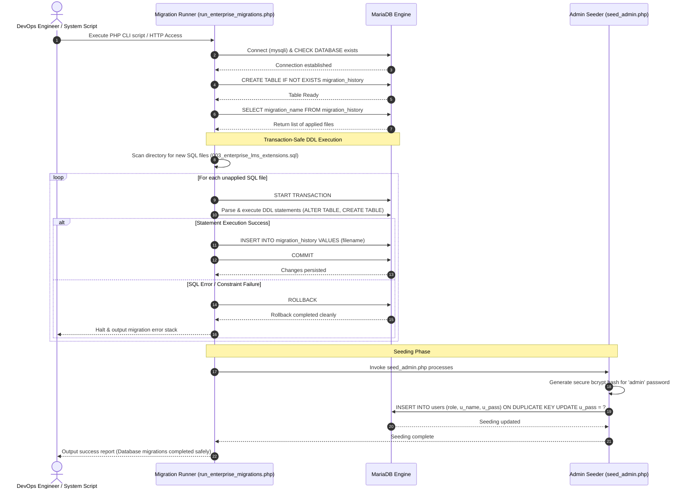

---

## 4. Advanced Security, Runtime States & Logic Diagrams

### A. UML State Machine Diagram: Exam Attempt Lifecycle
This tracks database record state transitions during live attempts, ensuring security thresholds are respected.

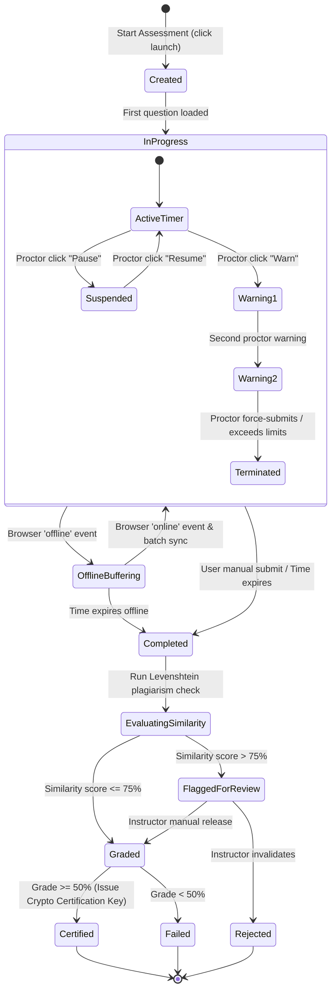

---

### B. UML Use Case Diagram: Actors & Bound Functions
This maps user access credentials and roles directly to secure execution cases in the portal boundary.

```mermaid
flowchart TD
    subgraph Users (Actors)
        Student([Student Candidate])
        Proctor([Proctor Invigilator])
        Admin([Master Administrator])
        Employer([Public Employer])
    end

    subgraph Exam Portal Suite (Use Cases)
        UC1(Login & Register Profile)
        UC2(Browse Subject Directories)
        UC3(Solve MCQ Assessment)
        UC4(Trigger Offline Answer Buffering)
        UC5(View Digital Skills passport)
        
        UC6(Monitor Active Telemetry Grid)
        UC7(Warn Candidate / Pause Timer)
        UC8(Add Questions with Syntax Preview)
        
        UC9(Create Classroom Cohorts)
        UC10(Bind Schedule Release Calendars)
        UC11(Extract Curriculum Performance Analytics)
        
        UC12(Search Public Certification Key)
    end

    Student --> UC1
    Student --> UC2
    Student --> UC3
    Student --> UC4
    Student --> UC5

    Proctor --> UC1
    Proctor --> UC6
    Proctor --> UC7
    Proctor --> UC8

    Admin --> UC1
    Admin --> UC6
    Admin --> UC7
    Admin --> UC8
    Admin --> UC9
    Admin --> UC10
    Admin --> UC11

    Employer --> UC12
```

---

### C. UML Component Diagram: Software Modular Dependencies
This blueprints codebase modular structures, execution libraries, and communication interfaces.

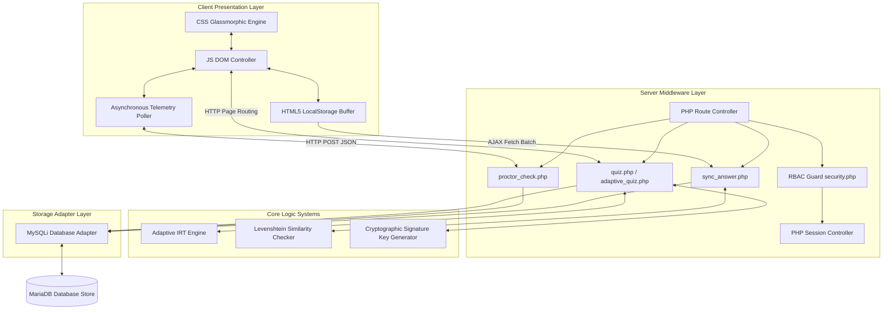

---

### D. UML Activity Diagram: IRT Adaptive Question Shifting Logic
This tracks the dynamic question selection logic trees executed inside `adaptive_quiz.php`.

```mermaid
flowchart TD
    Start([Initialize Adaptive Attempt]) --> SetMedium[Set Current Level = Medium]
    SetMedium --> LoadQuestion[Fetch Unsolved Question at Current Level]
    LoadQuestion --> GetAnswer[Collect Student Option Selection]
    GetAnswer --> EvalCorrect{Is Answer Correct?}
    
    EvalCorrect -->|Yes| LogSuccess[Record Success in History array]
    LogSuccess --> LevelUp{Current Level == Expert?}
    LevelUp -->|Yes| MaintainExpert[Keep Level = Expert]
    LevelUp -->|No| IncLevel[Shift Level Up Easy -> Med -> Hard -> Adv -> Expert]
    
    EvalCorrect -->|No| LogFail[Record Failure in History array]
    LogFail --> LevelDown{Current Level == Easy?}
    LevelDown -->|Yes| MaintainEasy[Keep Level = Easy]
    LevelDown -->|No| DecLevel[Shift Level Down Expert -> Adv -> Hard -> Med -> Easy]
    
    MaintainExpert --> CheckCount
    IncLevel --> CheckCount
    MaintainEasy --> CheckCount
    DecLevel --> CheckCount

    CheckCount{Total Questions Handled == 10?}
    CheckCount -->|No| LoadQuestion
    CheckCount -->|Yes| EndAssessment[Submit Attempt answers]
    
    EndAssessment --> AverageIRT[Extract Difficulty Values of the LAST 4 questions]
    AverageIRT --> CalculateScore[Compute average steady-state rating score]
    CalculateScore --> MapBadge[Map Rating to Skill Passport Badge]
    MapBadge --> IssueSignedCert[Issue Crypto Certification Key]
    IssueSignedCert --> End([Complete and Store Graded Attempt])
```

---

### E. Threat Model / Attack Tree Diagram: Portal Vulnerability Analysis
This maps threat vectors to system-engineered security controls to enforce database and credential integrity.

```mermaid
graph TD
    Attack([Compromise Exam Portal Integrity]) --> V1[Vertical Privilege Escalation]
    Attack --> V2[Candidate Cheating Infiltration]
    Attack --> V3[Certificate Forgery & Impersonation]
    Attack --> V4[Database Denial of Service DB crash]

    V1 --> V1_Sub[Direct URL manipulation targeting admin controllers]
    V1_Sub -.-> M1[Enforce require_admin Session checks at compilation start]

    V2 --> V2_Sub1[Timer Manipulation via local browser dev tools client scripts]
    V2_Sub1 -.-> M2[Verify countdown values on server-side HTTP attempt check-in]
    V2 --> V2_Sub2[Peer text copying in short answers subjective fields]
    V2_Sub2 -.-> M3[Run automated Levenshtein and Jaro-Winkler string similarity cross-checks]
    V2 --> V2_Sub3[Session switching/tab loss to search answers online]
    V2_Sub3 -.-> M4[Implement window focus/blur event monitoring telemetry warnings]

    V3 --> V3_Sub[Self-producing custom verification registry certification files]
    V3_Sub -.-> M5[Validate certificate lookups using cryptographically hashed SHA-256 signature verification keys]

    V4 --> V4_Sub[High-concurrency traffic floods during finals week]
    V4_Sub -.-> M6[Deploy Nginx Rate Limiting and execute MariaDB connection pools]

    classDef mitig fill:#dfd,stroke:#080,stroke-width:2px;
    classDef attack fill:#fdd,stroke:#800,stroke-width:2px;
    
    M1:::mitig
    M2:::mitig
    M3:::mitig
    M4:::mitig
    M5:::mitig
    M6:::mitig
    V1_Sub:::attack
    V2_Sub1:::attack
    V2_Sub2:::attack
    V2_Sub3:::attack
    V3_Sub:::attack
    V4_Sub:::attack
```

---

### F. UML Deployment Diagram: Infrastructure Environment Mappings
This blueprints physical hardware runtimes and staging architectures.

```mermaid
graph TD
    subgraph Developer Local Station Windows XAMPP
        DevClient[Browser Chrome/Edge] -- Localhost HTTP Port 80 --> DevApache[Apache 2.4 Server]
        DevApache -- PHP 8.x Engine --> DevDB[(MySQL Database 3306)]
    end

    subgraph Integration & CI Environment GitHub Runners
        CI_Container[Ubuntu Runner Container]
        CI_Container --> Lint[PHP CodeSniffer]
        CI_Container --> Test[PHPUnit & Security Checker]
    end

    subgraph Production Cloud Environment AWS EC2 / DigitalOcean
        Browser[Student Client Browser] -- HTTPS Port 443 --> WebProxy[Nginx Load Balancer]
        WebProxy -- Reverse Proxy round-robin --> WebServer1[Apache Node A -- PHP 8.x]
        WebProxy -- Reverse Proxy round-robin --> WebServer2[Apache Node B -- PHP 8.x]
        
        WebServer1 <--> CacheServer[(Redis Cache Cluster -- Session States)]
        WebServer2 <--> CacheServer
        
        WebServer1 --> MasterDB[(MariaDB 10.x Primary Database Node)]
        WebServer2 --> MasterDB
        
        MasterDB -- Asynchronous Replication --> SlaveDB[(MariaDB 10.x Read-Only Analytics Replica)]
    end
```

---

### G. Attack Surface / VPC Architecture Diagram (Physical Network Security)
This charts network isolation boundaries, firewalls, public NAT portals, and database VPC controls.

```mermaid
flowchart TD
    subgraph AWS Cloud Virtual Private Cloud VPC
        subgraph Public Subnet Internet Facing
            ALB[Application Load Balancer]
            NAT[NAT Gateway]
        end

        subgraph Private Application Subnet
            WebServerA[Apache PHP Worker Node A]
            WebServerB[Apache PHP Worker Node B]
        end

        subgraph Private Database & Caching Subnet
            Redis[(Redis Session Cache Cluster)]
            DBPrimary[(MariaDB Primary Database Server)]
            DBReplica[(MariaDB Replica Database Server)]
        end
    end

    User[External Candidate Client] -->|HTTPS Port 443 via Internet Gateway| ALB
    ALB -->|Forward dynamic traffic Port 80| WebServerA
    ALB -->|Forward dynamic traffic Port 80| WebServerB
    
    WebServerA -->|Private connection Port 6379| Redis
    WebServerB -->|Private connection Port 6379| Redis
    
    WebServerA -->|Prepared SQL statements Port 3306| DBPrimary
    WebServerB -->|Prepared SQL statements Port 3306| DBPrimary
    
    DBPrimary -->|Encrypted database mirror Port 3306| DBReplica
    
    WebServerA -->|Outbound updates| NAT
    WebServerB -->|Outbound updates| NAT
    NAT -->|Outbound queries via Internet Gateway| ExternalAPI[Third-party package managers]
```

---

### H. User Auth & Session Token Lifecycle Diagram
This sequence maps database hash fetches, session token distribution, authentication verification loops, and automated inactivity logouts.

```mermaid
sequenceDiagram
    autonumber
    actor Client as Candidate Browser
    participant App as PHP Login Handler (Auth.php)
    participant Redis as Redis Session Cache
    participant DB as MariaDB User Table

    Client->>App: Submits username & password via POST
    App->>DB: Fetch password_hash WHERE u_name = ?
    DB-->>App: Return user records
    App->>App: Verify password (password_verify)
    
    alt Credentials Invalid
        App-->>Client: Redirect to login with error banner (?err=1)
    else Credentials Valid
        App->>App: Initialize session properties (user_id, role, username)
        App->>Redis: Save session key payload (expires in 1800s)
        App->>Client: Inject HTTPOnly PHPSESSID cookie header
        App-->>Client: Redirect to dashboard (subject.php)
    end

    loop Active Session Telemetry
        Client->>App: Telebeat Poll (PHPSESSID Cookie included)
        App->>Redis: Check session key existence & touch expiration
        Redis-->>App: Return active status (Session Authorized)
        App-->>Client: Process active telemetric response
    end

    Note over Client, Redis: Automated Session Expiry Scenario (30 Min Inactivity)
    Redis->>Redis: Session key expires (Key TTL reaches 0)
    Client->>App: Heartbeat request with expired cookie
    App->>Redis: Check session key existence
    Redis-->>App: Return null (Session Expired)
    App->>App: Destroy local session arrays
    App-->>Client: Force Redirect to index.php with expired alert
```

---

### I. Plagiarism Engine Data Pipeline Diagram
This maps Jaro-Winkler, Levenshtein distance string evaluation algorithms, and student subjective response warning registries.

```mermaid
flowchart TD
    Start[Student Submits Subjective Text response] --> Extract[Extract text string answer]
    Extract --> Normalize[Text Normalization: strip punctuation, extra spaces, lower-case]
    Normalize --> QueryRef[Query DB for pre-defined Teacher Answer Key]
    Normalize --> QueryPeers[Query DB for all other student answers submitted in Cohort]
    
    QueryRef --> JW_Ref[Execute Jaro-Winkler evaluation against key]
    QueryRef --> Lev_Ref[Execute Levenshtein distance evaluation against key]
    
    QueryPeers --> JW_Peer[Execute Jaro-Winkler evaluation against peers]
    QueryPeers --> Lev_Peer[Execute Levenshtein distance evaluation against peers]

    JW_Ref & Lev_Ref --> CalcRefScore[Compute average reference similarity percentage]
    JW_Peer & Lev_Peer --> CalcPeerScore[Compute average peer-to-peer similarity percentage]

    CalcRefScore & CalcPeerScore --> ConsolidateScore[Calculate composite Plagiarism Index percentage]
    ConsolidateScore --> CheckThreshold{Similarity Score > 75%?}
    
    CheckThreshold -->|Yes| FlagDB[Insert record into attempt_answers with Flagged status]
    FlagDB --> AlertTeacher[Display High-Similarity warnings on Teacher Grade desk]
    
    CheckThreshold -->|No| SaveDB[Store standard similarity metrics in attempt_answers]
    
    SaveDB --> End([Plagiarism Pipeline execution complete])
    AlertTeacher --> End
```

---

### J. Client-Side Offline Resiliency Flowchart
This maps browser online-offline state listener event forks, LocalStorage buffering, and queue replay operations.

```mermaid
flowchart TD
    Start[Active quiz.php Session] --> WatchNet[Listen for browser offline event listener]
    WatchNet --> NetTrigger{Network Event Triggered?}
    
    NetTrigger -->|offline| SwapUI[Display Floating Glass offline banner]
    SwapUI --> FreezeSync[Intercept standard form POST submissions]
    FreezeSync --> SaveLocal[Stringify and write option selections to LocalStorage]
    SaveLocal --> QueueStates[Mark states: Pending Server Synchronization]
    QueueStates --> LoopOffline{Wait for online event listener}
    
    LoopOffline -->|No| SaveLocal
    LoopOffline -->|Yes| ReadCache[Read serialized JSON array from LocalStorage]
    
    ReadCache --> FetchBatch[Launch background AJAX fetch sync_answer.php]
    FetchBatch --> ServerConfirm{Server confirms persistence with 200 OK?}
    
    ServerConfirm -->|Yes| FlushCache[Clear answers entries from browser LocalStorage]
    FlushCache --> DismissUI[Hide floating offline banner]
    DismissUI --> ResResume[Restore normal interactive quiz operations]
    
    ServerConfirm -->|No| RetryTimer[Trigger backing delay timer 5s]
    RetryTimer --> FetchBatch
    
    NetTrigger -->|online| ResResume
    ResResume --> End([Resiliency Sync Active])
```

---

### K. Admin Privilege Guardrails & Self-Demotion Prevention Decision Flowchart
This details the safety checks implemented inside `admin_dashboard.php` to completely neutralize self-inflicted lockouts or accidental administrator privilege loss.

```mermaid
flowchart TD
    Start[Admin Clicks 'Change Role' / POST update_role.php] --> GetSession[Get $_SESSION user_id & role]
    GetSession --> GetTarget[Identify target_user_id & target_new_role]
    
    GetTarget --> CheckSelf{Is target_user_id == session_user_id?}
    
    CheckSelf -->|No: Modifying other user| ExecuteDB[Commit UPDATE users SET role = target_new_role WHERE id = target_user_id]
    
    CheckSelf -->|Yes: Modifying self| CheckAdmin{Is target_new_role != 'admin'?}
    
    CheckAdmin -->|No: Changing from admin to admin| ExecuteDB
    
    CheckAdmin -->|Yes: Self-demotion attempt| BlockAction[Intercept execution & lock database write]
    BlockAction --> WriteAudit[Log Security Warning to system logs: Self-Demotion Blocked]
    BlockAction --> AlertUser[Return JSON response: 'Self-Demotion Prevented: Admin must retain master control']
    
    ExecuteDB --> Success[Return JSON: 'User role updated successfully']
    Success & AlertUser --> End([Logic Handled])
```

---

### L. Question Editor Live Syntax Preview Rendering Lifecycle Activity Diagram
This defines the XSS-safe live client rendering loop mapping text area captures to monospaced formatted question editor boxes inside `admin_questions.php`.

```mermaid
flowchart TD
    Start[Teacher Types Question Text in Editor] --> WatchInput[keyup Event Listener active in JS]
    WatchInput --> GetContent[Retrieve textarea raw string value]
    
    GetContent --> SanitizeInput[Run secure HTML Entities translation: escape <script> and tags]
    SanitizeInput --> CheckMarkdown{Detect Markdown/Syntax backticks?}
    
    CheckMarkdown -->|Yes| ParseCode[Format inline and block coding text using monospaced styling CSS]
    CheckMarkdown -->|No| ParseNormal[Parse standard text paragraph formats]
    
    ParseCode & ParseNormal --> UpdateCanvas[Inject clean HTML string into glassmorphic preview canvas]
    UpdateCanvas --> RenderDOM[Render visually updated syntax box inside teacher editor workspace]
    
    RenderDOM --> End([State Synchronized])
```

---

### M. Invigilator Actions & Auditing Logging Pipeline Sequence Diagram
This maps sequence loops capturing proctor commands (Warn, Pause, Resume, Force-Submit) within secure databases, establishing compliance auditing trails.

```mermaid
sequenceDiagram
    autonumber
    actor Proctor as Invigilator Browser (proctor_console.php)
    participant API as Telemetry API Controller (proctor_check.php)
    participant DB as MariaDB database
    actor Student as Student Browser (quiz.php)

    Note over Proctor, DB: Proctor Intervention Execution
    Proctor->>API: Click action Warn/Pause/Terminate (POST attempt_id, command)
    API->>API: Enforce require_admin / require_teacher role guard
    
    alt Unauthorized session
        API-->>Proctor: Return 403 Forbidden Response
    else Authorized session
        API->>DB: START TRANSACTION
        API->>DB: UPDATE exam_attempts SET proctor_status = ?, proctor_paused = ? WHERE id = ?
        API->>DB: INSERT INTO proctor_logs (proctor_id, target_attempt_id, action, ip_address) VALUES (?, ?, ?, ?)
        API->>DB: COMMIT
        DB-->>API: Data written safely
        API-->>Proctor: Return 200 OK Action Status
    end

    Note over Student, DB: Student Telemetry Heartbeat Pickup
    loop Every 3 seconds
        Student->>API: Poll telemetry payload (attempt_id)
        API->>DB: SELECT proctor_status, proctor_paused FROM exam_attempts WHERE id = ?
        DB-->>API: Return active parameters
        API-->>Student: Return JSON (proctor_status: 'warning_1', proctor_paused: 1)
        
        alt Warning Status Triggered
            Student->>Student: Inject floating red alert notice toast
        else Pause Status Triggered
            Student->>Student: Freeze student local countdown timer
            Student->>Student: Inject blurred full-screen overlay locking inputs
        end
    end
```

---

### N. Connection Degradation & Server Exception Recovery State Diagram
This models real-time system performance adaptation strategies, detailing state changes under heavy traffic spikes or server failure occurrences.

```mermaid
stateDiagram-v2
    [*] --> HealthyState : Platform initialization
    
    state HealthyState {
        [*] --> IdleListening
        IdleListening --> QueryProcessing : Incoming HTTP Request
        QueryProcessing --> IdleListening : Transaction complete 200 OK
    }
    
    HealthyState --> DegradedState : MariaDB Connection Pool Exhausted (3306 timeout)
    HealthyState --> DegradedState : Server-side unhandled exception (500 Error)
    
    state DegradedState {
        [*] --> InterceptRequest
        InterceptRequest --> RenderFallback : Route to custom local cache recovery page
        RenderFallback --> QueryRetry : Trigger background auto-retry connection check
        QueryRetry --> InterceptRequest : Check fails
    }
    
    DegradedState --> HealthyState : Connection restored / Resource pool cleared
    
    HealthyState --> RateLimitedState : HTTP requests count > 100/min per IP
    
    state RateLimitedState {
        [*] --> BlockIP
        BlockIP --> RenderRateAlert : Return 429 Too Many Requests
        RenderRateAlert --> CoolDownTimer : Wait 60s
    }
    
    RateLimitedState --> HealthyState : CoolDownTimer expires
```
