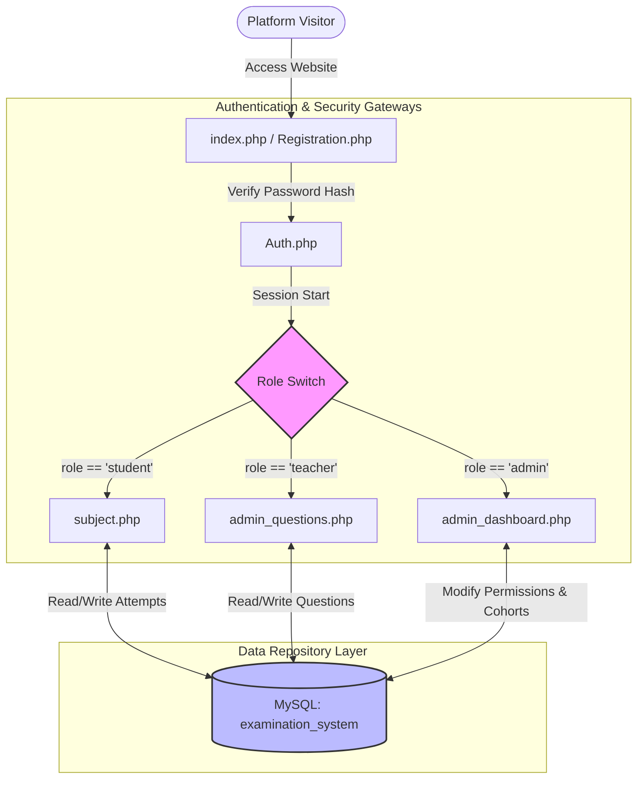
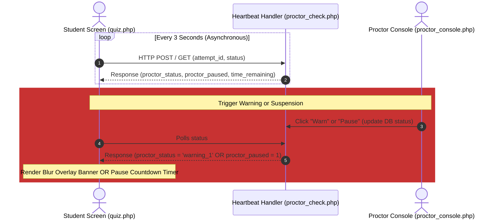
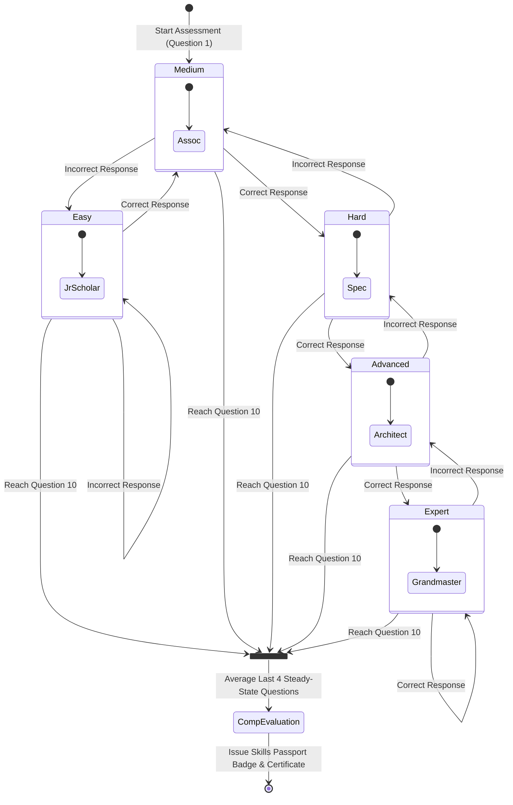
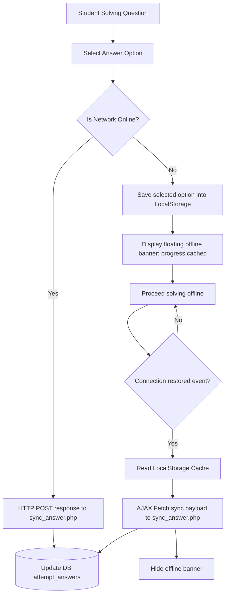

# Enterprise Online Examination & Learning Management Suite
### Comprehensive Architecture, Features Catalog, and System Flow Documentation

---

## 1. Executive Summary & Platform Overview

The **Enterprise Online Examination & Learning Management Suite** is a high-security, role-based assessment platform designed to deliver secure, scalably distributed, and highly interactive examinations. Built with a translucent glassmorphic dark-themed UI matching customized HSL color palettes, the system balances rigorous invigilation mechanisms with advanced pedagogical instruments. 

Key pillars of the architecture include:
* **Strict Role-Based Access Control (RBAC)** separating Students, Teachers, and Master Administrators.
* **Simulated Proctor Telemetry** syncing student states (pause, warn, terminate) in real time over a 3-second JSON heartbeat.
* **Pedagogical Adaptivity** utilizing an Item Response Theory (IRT) difficulty transition engine to evaluate candidate skills ceilings.
* **Fail-Safe Offline Protection** preserving active states inside client-side LocalStorage during network crash events and auto-syncing choices once connection is restored.
* **Curricular Insights** providing cohort distribution analytics, Bell curves, and automated subjective similarity plagiarism screening.
* **Registry Integrity** issuing cryptographically signed verification keys to candidates who achieve passing status, validated via a public-facing gold-foil registry.

---

## 1.5. Platform Technology Stack

The platform is built on a high-performance, lightweight, and self-hosted local technology stack designed for absolute security, low latency, and ease of deployment:

### A. Frontend Presentation Layer
The front end of the platform delivers a premium, dark-themed user interface featuring glassmorphic designs, customized HSL color palettes, and smooth interactive micro-animations.

* **HTML5 (Semantic Markup)**: Establishes structured pages (e.g., registration, subject directories, and dashboards) using modern semantic elements to optimize accessibility and cross-browser stability.
* **Vanilla CSS3 (Layout & Styling)**: 
  * Utilizes CSS Flexbox and Grid systems to ensure responsive visual rendering across mobile, tablet, and desktop viewports.
  * Leverages standard HSL custom variables for unified, sleek dark-themed components.
  * Applies modern styling features such as `backdrop-filter: blur()` for glassmorphism, responsive shadow tokens, and custom animations (`transform` transitions) on hover states.
* **Vanilla JavaScript (ES6+ Logic)**:
  * **Proctor Telemetry**: Polls the server via an asynchronous loop every 3 seconds to sync proctor status actions in real time.
  * **Offline-Safe Recovery**: Listens for browser connection changes (`window.addEventListener('online'/'offline')`) and automatically caches candidate choices in `LocalStorage` when offline, syncing answers back to the database once connectivity is restored.
  * **Interactive DOM Updates**: Handles client-side options selection highlights, timer countdown rendering, and canvas-based analytics rendering.

### B. Backend Application Layer
The backend is designed for self-contained, offline-first execution, making it suited for both local servers and enterprise intranets.

* **PHP 8.x (Hypertext Preprocessor)**: Server-side object-oriented and functional engine handling:
  * **Stateful Sessions**: Employs secure session arrays (`$_SESSION`) to handle authentication state transitions, role divisions (Student, Teacher, Admin), and adaptive placement metrics safely.
  * **Pre-compiled Prepared SQL Statements**: Communicates with the database using PHP's native `mysqli` driver, enforcing strict type binding to completely neutralize SQL Injection (SQLi) vulnerabilities.
  * **Algorithmic Processing**: Hosts the Item Response Theory (IRT) adaptive difficulty selection engine, cryptographically secure signature generation for passing certificates, and short-answer Levenshtein distance string similarity plagiarism checks.

### C. Database Persistence Layer
The persistent layer uses a robust relational database structure to secure transaction integrity and maintain high performance.

* **MySQL 5.7+ / MariaDB 10.x**: Highly performant relational database management system using:
  * **Role-Based Access Control (RBAC)**: Manages users across designated roles (`student`, `teacher`, `admin`).
  * **Data Consistency**: Configured with strict foreign key relationships using `ON DELETE CASCADE` rules to prevent orphaned rows when questions, cohorts, or users are removed.
  * **Extended Proctor Logs**: Logs telemetry state properties (`proctor_status`, `proctor_paused`, `time_remaining_sec`) and answers history.

### D. Local Hosting & Server Environment
* **Apache HTTP Server**: Serves application endpoints securely.
* **XAMPP / Local PHP Environment**: Uses Apache + PHP + MySQL on Windows environments, running standard PHP dev servers at `http://localhost:8000`.

---

## 2. Core Platform Architecture & System Flows (Diagrams)

### A. General System Architecture & Authentication Routing
This diagram outlines how different user roles are authenticated and routed to their respective workspaces, and how data interacts with the persistent layer.



---

### B. Live Proctoring Heartbeat & Telemetry Workflows
The sequence below illustrates the 3-second asynchronous connection loop between the candidate taking the exam and the proctoring dashboard.



---

### C. AI-Driven Adaptive Difficulty Transition Engine (Placement Mode)
This state diagram demonstrates how the placement test adjusts question difficulty in real time based on candidate responses.



---

### D. Offline State Recovery & Storage Synchronization Flowchart
This flowchart explains how the platform guards against connection loss and recovers state safely.



---

## 3. Step-by-Step Chronological Guide to Core (Existing) Features

These modules represent the foundational capabilities of the LMS before the installation of the advanced enterprise modules:

### Step 1: Secure Registration & Account Seeding
* **Operation**: Candidates sign up via `Registration.php` supplying user metrics (Full Name, Username, Email, Age, Mobile, Address, Password).
* **Cryptography**: Passwords are securely hashed using `PASSWORD_DEFAULT` (bcrypt algorithm) at the application layer before database commitment. No plain text passwords ever cross the data boundary.
* **Auto-Default Role**: Newly registered users are initialized with the `student` role.
* **Administrative Account Seeding**: A secure seeder `seeds/seed_admin.php` validates and initializes the platform's master root control credentials:
  * **Username**: `admin`
  * **Password**: `admin123`
  * **Role**: `admin`

### Step 2: Adaptive Gateway Authentication & Role-Based Routing
* **Operation**: Handled via `index.php` (Frontend Panel) and `Auth.php` (Validation Controller).
* **Security Controls**: Uses strict database queries to extract the hashed password. If correct, values are populated into safe `$_SESSION` slots (`user_id`, `u_name`, `role`).
* **Intelligent Routing Redirect**:
  * Standard **Students** are immediately redirected to `subject.php`.
  * Fully privileged **Admins** bypass standard student views and are routed straight to `admin_dashboard.php`.

### Step 3: Subjects & Catalog Directory Navigation
* **Operation**: Handled inside `subject.php`. Renders an interactive catalog of all available examination categories (e.g. Java, PHP, Web Design).
* **UI Theme**: Features a linear dark layout decorated with translucent CSS backdrops (`backdrop-filter: blur()`), vibrant gradient cards, and smooth micro-animations on hover.
* **Verification Checks**: Generates buttons to trigger either **Official Exams** (graded and registered) or **Mock Assessments** (safe practices).

### Step 4: Traditional Linear MCQ Exam Solver
* **Operation**: Executed inside `quiz.php`. Retrieves a randomized pool of standard multiple-choice questions matching the selected subject.
* **Countdown Enforcement**: Pulls exam parameters to bind a countdown timer at the top header, forcing auto-submission once time is exhausted.
* **Self-Navigation**: Displays individual question blocks where users can choose their response radios.

### Step 5: Scoring Evaluation & Traditional Grading
* **Operation**: Structured inside `result.php`. Computes results immediately upon submission.
* **Algorithmic Grading**:
  * Loops through all selected answers and matches them against `questions.correct_answer`.
  * Computes score and grade percentages (e.g. `(Correct Responses / Total Questions) * 100`).
  * Saves attempt records (`score`, `percentage`, `submitted_at`, status = `completed`) in `exam_attempts` and detailed logs in `attempt_answers`.
* **Visual Breakdown**: Presents the candidate with their overall grade, a performance status ring, and redirect actions.

### Step 6: Review Panel (Answers Self-Inspection)
* **Operation**: Configured inside `review.php`. Candidates inspect completed tests.
* **Color Code Validation**: Renders each question from the test showing:
  * The question text and explanation block.
  * The student's chosen answer highlighted in red (if incorrect) or green (if correct).
  * The correct response standard highlighted in green for immediate study feedback.

### Step 7: Global Leaderboard & Speed-Run Rankings
* **Operation**: Displayed in `leaderboard.php`. Calculates competitive scoring logs.
* **Performance Calculations**:
  * Orders candidates system-wide by their highest exam percentage.
  * Breaks ties using **Speed Efficiency** (calculated from `started_at` and `submitted_at` duration intervals).
  * Showcases top performers in styled gold, silver, and bronze podium cards.

---

## 4. Deep-Dive Operational Guide to the 9 Advanced (Added) LMS Extensions

These extensions represent the advanced enterprise scaling modules built to provide high security, real-time monitoring, pedagogy adaptation, and curriculum analysis:

### 🛠️ Module 1: Unified Question Editor Panel (Teacher & Admin CRUD)
* **File Location**: `Exam/admin_questions.php`
* **Features**:
  * **Role Restriction**: Guarded via `require_login()` and an authorization check allowing access only to `admin` and `teacher` sessions.
  * **Interactive Creator Form**: Select subject, difficulty level (`Easy`, `Medium`, `Hard`, `Advanced`, `Expert`), and type (`MCQ`, `TRUE_FALSE`, `SHORT_ANSWER`).
  * **Explosive Syntax Preview**: Code syntax blocks inside the question content automatically format using a live monospaced renderer.
  * **Full CRUD Table**: Shows all question banks in a filterable grid with inline Edit and Delete options.

### 👁️ Module 2: Live Active Proctor Console (Simulated Invigilation Dashboard)
* **File Location**: `Exam/proctor_console.php` & `Exam/proctor_check.php`
* **Features**:
  * **Proctor Control Center**: Displays a live grid of every active candidate session currently taking an examination.
  * **Telemetry Actions**:
    * **Warn Candidate**: Triggers real-time alert popups on the candidate's browser screen (transitions state: `monitoring` &rarr; `warning_1` &rarr; `warning_2`).
    * **Pause Exam**: Freezes the candidate's countdown timer and renders a full-screen, blurred glassmorphic overlay overlaying: *"Session Paused by Proctor"*.
    * **Resume Exam**: Releases the overlay and restores normal countdown.
    * **Force Submit**: Instantly closes the student's test session, scores all currently answered items, and processes their output status as `completed`.
  * **Synchronization Heartbeat**: The student's screen (`quiz.php`) executes a 3-second background polling process calling `proctor_check.php` to immediately read and apply these proctor updates.

### 🔌 Module 3: HTML5 Offline-Safe State Recovery (Network Protection)
* **File Location**: Integrated inside `Exam/quiz.php` and `Exam/sync_answer.php`
* **Features**:
  * **Connection Watchers**: Listens to browser events `window.addEventListener('offline')` and `'online'`.
  * **Local State Caching**: If the network connection drops mid-exam:
    * The platform displays a prominent floating glass banner: `⚠️ Working Offline - Progress Safely Cached`.
    * Every answer selected is automatically serialized and cached in the browser's `LocalStorage`.
  * **Auto-Sync Trigger**: When connection is restored:
    * The system reads the local cache and uses a background `fetch()` request to sync the answers back to the MySQL database via `sync_answer.php`.
    * The offline banner is hidden, ensuring zero data loss during high-stakes exams.

### 🧬 Module 4: Dynamic AI-Driven Adaptive Testing (Placement Mode)
* **File Location**: `Exam/adaptive_quiz.php`
* **Features**:
  * **Item Response Theory (IRT) Flow**: Bypasses fixed difficulty testing. Serves a starting question at `Medium` level.
  * **Real-Time Level Adjustment**:
    * Answering correctly shifts subsequent questions to a higher tier (`Hard` &rarr; `Advanced` &rarr; `Expert`).
    * Answering incorrectly lowers the complexity tier (`Easy`).
  * **Compensatory Index Scoring**: To ensure fairness and avoid early-stage penalties, the final rating is calculated by averaging the difficulty values of the last four steady-state questions the candidate encountered.
  * **Competency Badging**: Maps scores to specific competency titles (e.g. `Elite Architect (Tier IV)`, `Grandmaster Technologist (Tier V)`) and plots their path transition map.

### 🎨 Module 5: Gamified Achievements & "Skills Passport"
* **File Location**: `Exam/skills_passport.php`
* **Features**:
  * **Achievement Engine**: Evaluates completion metrics upon exam submission to reward digital accomplishments:
    * ☕ **Java Artisan**: Earned by passing any Java exam.
    * 🎓 **PHP Master**: Earned by passing a Hard or Advanced PHP exam.
    * ⚡ **Turbo Speedster**: Earned by submitting a passing exam in under 5 minutes.
    * 🏆 **Absolute Perfection**: Awarded for achieving a 100% score on any official exam.
  * **Interactive Passport Dashboard**: Renders all locked and unlocked credentials inside a premium glassmorphic badge wall, complete with a public-facing share link.

### 🏫 Module 6: Cohort & Classroom Directory (Multi-Tenant Management)
* **File Location**: `Exam/admin_cohorts.php`
* **Features**:
  * **Multi-Tenant Enclosures**: Admins group candidates into dedicated Cohorts (Classrooms).
  * **Scheduled Release Calendars**: Enables binding exam categories to cohorts with exact availability schedules (`opens_at` and `closes_at` datetimes).
  * **Candidate Availability Filter**: Restricts standard students' views in `subject.php` so they only see and launch examinations linked to their enrolled cohorts within open schedule windows.

### 📊 Module 7: Advanced Cohort Performance Analytics & Insights
* **File Location**: `Exam/analytics.php`
* **Features**:
  * **Bell-Curve Grade Distribution**: Renders a visually clear grade distribution chart mapping performance categories.
  * **Curricular Accuracy Checker**: Automatically identifies and lists the top 5 hardest questions on the platform (based on lowest candidate accuracy rates) to help teachers target instruction.
  * **Early Support Warning System**: Flags candidates whose average score across all attempts falls below 50%, signaling that they may need additional academic support.

### 🛡️ Module 8: Public Certificate Verification Registry
* **File Location**: `Exam/verify.php`
* **Features**:
  * **Public Verification**: A secure, public-facing portal (no login required) where employers or institutions can verify credentials.
  * **Crypto-Signed Verification Hash**: Validates keys like `CERT-EPP-[attempt_id]-[hash]` against secure records.
  * **Gold-Foil Certificate Template**: Displays a premium certificate design featuring a verified status stamp, student name, score, subject, and completion date.

### 📝 Module 9: Subjective Plagiarism & Similarity Engine
* **File Location**: `Exam/lib/plagiarism_checker.php`
* **Features**:
  * **Text Comparison Algorithm**: Uses Levenshtein and Jaro-Winkler string similarity calculations to compare subjective, short-answer responses.
  * **Academic Dishonesty Screening**: Compares student responses against:
    * The teacher's pre-defined answer key.
    * Answers submitted by peer candidates in the same cohort.
  * **Similarity Heatmap**: Flags high similarity rates on evaluation screens to prevent cheating.

---

## 5. Comprehensive Database Model & Schema Reference

The database structure relies on normalized relations, using foreign key constraints with cascade deletes to maintain database cleanups automatically.

```sql
-- 1. Subject Category Inventory
CREATE TABLE IF NOT EXISTS subjects (
    id INT AUTO_INCREMENT PRIMARY KEY,
    name VARCHAR(100) NOT NULL UNIQUE
);

-- 2. Multi-Role User Profile Inventory
CREATE TABLE IF NOT EXISTS users (
    id INT AUTO_INCREMENT PRIMARY KEY,
    f_name VARCHAR(50) NOT NULL,
    m_name VARCHAR(50) DEFAULT NULL,
    l_name VARCHAR(50) NOT NULL,
    u_name VARCHAR(50) NOT NULL UNIQUE,
    u_email VARCHAR(100) NOT NULL UNIQUE,
    u_pass VARCHAR(255) NOT NULL, -- Cryptographically Hashed password
    u_age INT NOT NULL,
    u_mob VARCHAR(15) NOT NULL,
    u_adr TEXT NOT NULL,
    role ENUM('student', 'teacher', 'admin') NOT NULL DEFAULT 'student',
    created_at TIMESTAMP DEFAULT CURRENT_TIMESTAMP
);

-- 3. Dynamic Question Pool Inventory
CREATE TABLE IF NOT EXISTS questions (
    id INT AUTO_INCREMENT PRIMARY KEY,
    subject_id INT NOT NULL,
    level ENUM('Easy', 'Medium', 'Hard', 'Advanced', 'Expert') NOT NULL DEFAULT 'Medium',
    type ENUM('MCQ', 'TRUE_FALSE', 'SHORT_ANSWER') NOT NULL DEFAULT 'MCQ',
    question TEXT NOT NULL,
    option_a TEXT NOT NULL,
    option_b TEXT NOT NULL,
    option_c TEXT NOT NULL,
    option_d TEXT NOT NULL,
    correct_answer VARCHAR(10) NOT NULL,
    explanation TEXT DEFAULT NULL,
    FOREIGN KEY (subject_id) REFERENCES subjects(id) ON DELETE CASCADE
);

-- 4. Cohorts (Classrooms) Inventory
CREATE TABLE IF NOT EXISTS cohorts (
    id INT AUTO_INCREMENT PRIMARY KEY,
    name VARCHAR(150) NOT NULL UNIQUE,
    created_at TIMESTAMP DEFAULT CURRENT_TIMESTAMP
);

-- 5. Cohort Membership Map
CREATE TABLE IF NOT EXISTS cohort_members (
    id INT AUTO_INCREMENT PRIMARY KEY,
    cohort_id INT NOT NULL,
    user_id INT NOT NULL,
    created_at TIMESTAMP DEFAULT CURRENT_TIMESTAMP,
    FOREIGN KEY (cohort_id) REFERENCES cohorts(id) ON DELETE CASCADE,
    FOREIGN KEY (user_id) REFERENCES users(id) ON DELETE CASCADE,
    UNIQUE KEY uq_cohort_user (cohort_id, user_id)
);

-- 6. Cohort Scheduled Release Time Map
CREATE TABLE IF NOT EXISTS subject_cohorts (
    id INT AUTO_INCREMENT PRIMARY KEY,
    subject_id INT NOT NULL,
    cohort_id INT NOT NULL,
    opens_at DATETIME NULL,
    closes_at DATETIME NULL,
    FOREIGN KEY (subject_id) REFERENCES subjects(id) ON DELETE CASCADE,
    FOREIGN KEY (cohort_id) REFERENCES cohorts(id) ON DELETE CASCADE,
    UNIQUE KEY uq_subject_cohort (subject_id, cohort_id)
);

-- 7. Gamified Badges Catalog
CREATE TABLE IF NOT EXISTS badges (
    id INT AUTO_INCREMENT PRIMARY KEY,
    name VARCHAR(100) NOT NULL UNIQUE,
    description TEXT NOT NULL,
    icon VARCHAR(10) NOT NULL, -- Emoji Symbol
    condition_type VARCHAR(50) NOT NULL, -- 'subject_pass', 'perfect_score', 'speed_run', etc.
    condition_value VARCHAR(100) NOT NULL
);

-- 8. User Unlocked Badges Ledger
CREATE TABLE IF NOT EXISTS user_badges (
    id INT AUTO_INCREMENT PRIMARY KEY,
    user_id INT NOT NULL,
    badge_id INT NOT NULL,
    unlocked_at TIMESTAMP DEFAULT CURRENT_TIMESTAMP,
    FOREIGN KEY (user_id) REFERENCES users(id) ON DELETE CASCADE,
    FOREIGN KEY (badge_id) REFERENCES badges(id) ON DELETE CASCADE,
    UNIQUE KEY uq_user_badge (user_id, badge_id)
);

-- 9. Secure Exam Attempts Ledger (Proctor-Extended)
CREATE TABLE IF NOT EXISTS exam_attempts (
    id INT AUTO_INCREMENT PRIMARY KEY,
    verification_key VARCHAR(100) UNIQUE DEFAULT NULL, -- High-integrity cryptographic key
    user_id INT NOT NULL,
    subject_id INT NOT NULL,
    level ENUM('Easy', 'Medium', 'Hard', 'Advanced', 'Expert') NOT NULL DEFAULT 'Medium',
    total_questions INT NOT NULL,
    score INT NOT NULL DEFAULT 0,
    percentage DECIMAL(5,2) NOT NULL DEFAULT 0.00,
    started_at DATETIME NOT NULL,
    submitted_at DATETIME DEFAULT NULL,
    exam_mode ENUM('official', 'mock') NOT NULL DEFAULT 'official',
    exam_type ENUM('official', 'mock', 'adaptive') NOT NULL DEFAULT 'official',
    proctor_status ENUM('monitoring', 'warning_1', 'warning_2', 'suspended', 'completed') NOT NULL DEFAULT 'monitoring',
    proctor_paused TINYINT(1) NOT NULL DEFAULT 0,
    time_remaining_sec INT NOT NULL DEFAULT 3600,
    FOREIGN KEY (user_id) REFERENCES users(id) ON DELETE CASCADE,
    FOREIGN KEY (subject_id) REFERENCES subjects(id) ON DELETE CASCADE
);

-- 10. Attempt Question Options Ledger
CREATE TABLE IF NOT EXISTS attempt_answers (
    id INT AUTO_INCREMENT PRIMARY KEY,
    attempt_id INT NOT NULL,
    question_id INT NOT NULL,
    selected_answer VARCHAR(10) DEFAULT NULL,
    is_correct TINYINT(1) NOT NULL DEFAULT 0,
    similarity_score DECIMAL(5,2) DEFAULT NULL, -- Plagiarism engine metric
    FOREIGN KEY (attempt_id) REFERENCES exam_attempts(id) ON DELETE CASCADE,
    FOREIGN KEY (question_id) REFERENCES questions(id) ON DELETE CASCADE
);
```

---

## 6. Guide to Explaining this Project to Evaluators

If presenting or explaining this platform to developers, teachers, or evaluators, structure your presentation into four stages:

1. **The Core Philosophy (RBAC & User Flow)**:
   * *"We built a fully secured, enterprise-grade assessment engine. When a student logs in, they see their subjects and scheduled classes (Cohorts). An administrator or teacher enters a centralized dashboard to manage catalog subjects, adjust user permissions dynamically (Student, Teacher, Admin), and construct new question pools with syntax previews."*
2. **Real-time Proctoring Integrity (Telemetry)**:
   * *"To prevent cheating, we developed a active invigilator dashboard. The proctor can monitor progress live. By polling a heartbeat script every three seconds in the student's browser, the system allows the proctor to issue warnings, pause the exam countdown, or force-submit the test instantly."*
3. **Advanced Pedagogy (Adaptivity & Gamification)**:
   * *"Instead of standard tests, the platform features an AI Adaptive Placement Mode. The system gauges the candidate's actual skill level by adjusting subsequent question difficulties in real time based on their correctness. At the end, the system averages their steady-state difficulty to unlock digital skills badges (like 'PHP Master' or 'Java Artisan') on their profile page."*
4. **Resiliency & Credential Safety (Offline Sync & Certificates)**:
   * *"If a candidate's internet drops, they don't lose any progress. A local HTML5 worker automatically saves their choices in LocalStorage and syncs them back to the database once connection is restored. Upon passing, a cryptographically signed verification key is generated, allowing external employers to verify their credentials on our public certificate registry page."*
